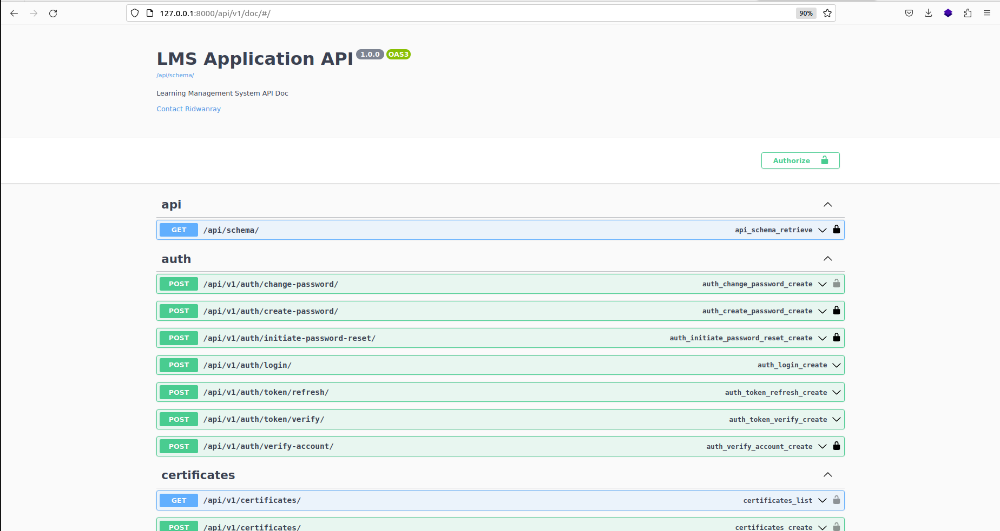
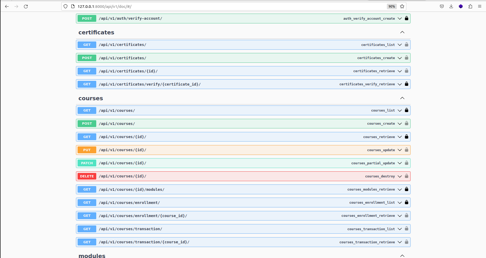
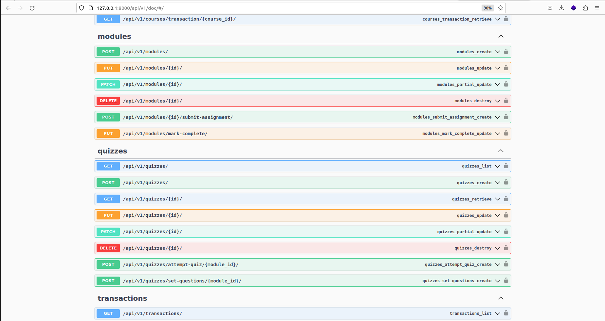
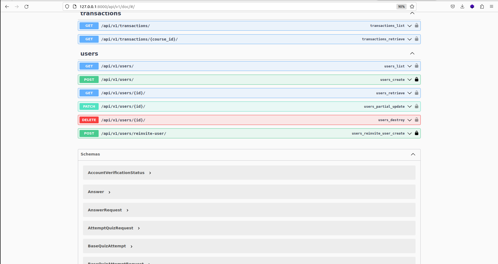

# Django LMS (Learning Management System)
This is a full-fledged online school API. 
It covers advanced features
-progress tracking
-certificate generation
-Quiz
-Assigments
-Chat:Todos

## Auth & Roles:
- SuperAdmin
- Student
- Teacher
- SchoolAdmin

## Running locally

Create a .env file by copying the .env.sample provided and run:
```
docker compose build && docker compose up
```
to start the container. As an alternative, run:
```
docker compose -f docker-compose.dev.yml up --build
```
to build and run the container using the dev yaml file.
Make sure to externalize the db instance to be used. It can be in another container.

## Run tests
Run descriptive tests in the container using:
```
docker compose exec <docker_container_name> pytest -rP -vv
```

Access the docs on:

```
http://localhost:8000/api/v1/doc
```


## Running In a Virtual Env

Create a virtual environment using:
```
mkvirtualenv <env_name>
```

Ensure you have installed `virtualenv` on your system and install dev dependencies using
```
pip install -r app/requirements/dev.txt
```

Navigate to app directory and run migrations using:
```
python manage.py makemigrations

python manage.py migrate
```

Run the server using:
```
python manage.py runserver
```

Access docs:
```sh
http://localhost:8000/api/v1/doc
```

## Documentation









